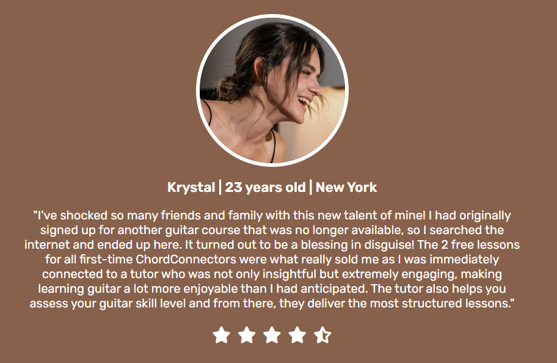
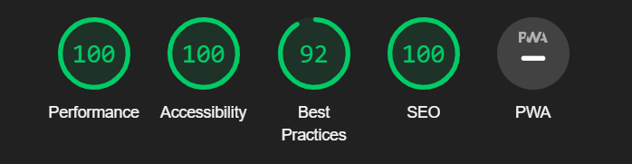

# ChordConnect

ChordConnect has made learning guitar as simple as learning your ABCs and 123s for individuals of all ages and skill levels. It is designed as a fully online programme that provides high-quality one-to-one lessons to anyone, anywhere in the world. The programme is managed by a group of dedicated professional guitarists, each with their own musical style. "Rock," "Jazz" and "Blues" are the three most popular styles. To become the next Jimi Hendrix, Jimmy Page (Led Zeppelin) or Brian May (Queen), all you need is a dash of curiosity, a six-stringed guitar and a lesson with Chordconnect!

## Features 

### Existing Features

- __Navigation Bar__

  - A full responsive navigation bar that is fixed at the top of the screen and present across the entire website, from the header to sections to the footer, to enable quick and easy navigation and prevent scrolling repetition.
  - It includes links to the Logo, Homepage, About us, Tutors, Testimonials, Sign up form and Contact information.

- __Hamburger Menu__

  - A complete responsive hamburger menu fixed at the top of the screen is a feature of displays for tablets and mobile phones, allowing for quick and straightforward navigation and minimizing scrolling repetition.
  - It expands upon clicking to show links to the Logo, Homepage, About Us, Tutors, Testimonials, Sign up form, and Contact information.

- __The landing page image__

  - The landing page features an image with text overlay to show the pricing of the lessons as well as a special offer for all newcomers to the programme.
  - A button is also added to take the user directly to the Sign up form, bypassing all prior material and information, allowing the user a fast and simple sign up procedure.
  - This part draws the user's attention to ChordConnect using an aesthetically stunning image and banner.

- __About Us Section__

  - The about us will provide the user with an overview of ChordConnect, its most popular music style lessons, further information about the special offer for new "ChordConnectors," and a phrase at the end to urge the user to start learning and playing the guitar with them.

- __Meet the Tutors section__

  - The user will be able to get better acquainted with the ChordConnect tutors in this section, and when the mouse "hovers" or the photo is "clicked on", the images will flip over to reveal the tutors' name and information.
  - The "flip card" animation will allow for engaging user interaction and captivate their attention.

- __Testimonials__

  - The testimonials area will allow users to hear what other people, their peers, have experienced while learning guitar with ChordConnect. It is an essential feature to establish trust with future "ChordConnectors".
  - Three testimonials are presented, each with a photo of the person, name, age, location, statements, and a star rating at the bottom. It is designed in a clear and concise manner.

- __The Sign Up Page__

  - This page will allow the user to get signed up to ChordConnect to begin their path to become the next great guitarist. 
  - The user will be required to submit their basic details, including their first name, last name and email address.
  - For assessment of the user's guitar skill level, the user will be asked "What guitar skill level are you?" and will have the option of selecting "Beginner, Intermediate, Advanced or I'm Not Sure".
  - The user will also have the option to answer "How did you hear about us?" to aid ChordConnect with advertising.
  - Lastly, a textarea box is included at the bottom for any further questions or information the user wishes to disclose.

- __The Footer__ 

  - The footer section includes contact details for users to phone or email ChordConnect if there are any queries or issues.
  - It also includes the social media links for ChordConnect's Facebook, Twitter, Instagram and YouTube pages, all of which, will open to a new browser tab for quick navigation and removal of the "back button" repetition.
  - Lastly, a copyright tag is placed at the end of the page.

### Future goals

  - To add a gallery collection of ChordConnect students playing guitar live onstage and concerts.
  - To create it in a slideshow animation which would require better javascript knowledge.
  - To use a video as the "landing page" or "hero image" which was initially used but later replaced by a still image due to responsiveness issues.

## Testing 

  - Testing was carried out by Chrome DevTools to ensure the website had the appropriate scaling for laptop, tablet and moble phone screens.
  - Lighthouse
    - [Lighthouse](https://chrome.google.com/webstore/detail/lighthouse/blipmdconlkpinefehnmjammfjpmpbjk?hl=en) was used throughout the project to improve webpage performance, accessibility and reduce loading screen times.
      - Website Desktop Report

      
      - Website Mobile Phone Report
      
      

### Validator Testing 

- HTML
  - No errors were found when passing through the official [W3C validator](https://validator.w3.org/)

- CSS
  - No errors were found when passing through the official [(Jigsaw) validator](https://jigsaw.w3.org/css-validator/)

### Unfixed Bugs

You will need to mention unfixed bugs and why they were not fixed. This section should include shortcomings of the frameworks or technologies used. Although time can be a big variable to consider, paucity of time and difficulty understanding implementation is not a valid reason to leave bugs unfixed. 

## Deployment

This section should describe the process you went through to deploy the project to a hosting platform (e.g. GitHub) 

- The site was deployed to GitHub pages. The steps to deploy are as follows: 
  - In the GitHub repository, navigate to the Settings tab 
  - From the source section drop-down menu, select the Master Branch
  - Once the master branch has been selected, the page will be automatically refreshed with a detailed ribbon display to indicate the successful deployment. 

The live link can be found here - https://code-institute-org.github.io/love-running-2.0/index.html 

## Credits 

In this section you need to reference where you got your content, media and extra help from. It is common practice to use code from other repositories and tutorials, however, it is important to be very specific about these sources to avoid plagiarism. 

You can break the credits section up into Content and Media, depending on what you have included in your project. 

### Content 

- The text for the Home page was taken from Wikipedia Article A
- Instructions on how to implement form validation on the Sign Up page was taken from [Specific YouTube Tutorial](https://www.youtube.com/)
- The icons in the footer were taken from [Font Awesome](https://fontawesome.com/)

### Media

- The photos used on the home and sign up page are from This Open Source site
- The images used for the gallery page were taken from this other open source site

Congratulations on completing your Readme, you have made another big stride in the direction of being a developer! 

## Other General Project Advice

Below you will find a couple of extra tips that may be helpful when completing your project. Remember that each of these projects will become part of your final portfolio so it’s important to allow enough time to showcase your best work! 

- One of the most basic elements of keeping a healthy commit history is with the commit message. When getting started with your project, read through [this article](https://chris.beams.io/posts/git-commit/) by Chris Beams on How to Write  a Git Commit Message 
  - Make sure to keep the messages in the imperative mood 

- When naming the files in your project directory, make sure to consider meaningful naming of files, point to specific names and sections of content.
  - For example, instead of naming an image used ‘image1.png’ consider naming it ‘landing_page_img.png’. This will ensure that there are clear file paths kept. 

- Do some extra research on good and bad coding practices, there are a handful of useful articles to read, consider reviewing the following list when getting started:
  - [Writing Your Best Code](https://learn.shayhowe.com/html-css/writing-your-best-code/)
  - [HTML & CSS Coding Best Practices](https://medium.com/@inceptiondj.info/html-css-coding-best-practice-fadb9870a00f)
  - [Google HTML/CSS Style Guide](https://google.github.io/styleguide/htmlcssguide.html#General)

Getting started with your Portfolio Projects can be daunting, planning your project can make it a lot easier to tackle, take small steps to reach the final outcome and enjoy the process! 