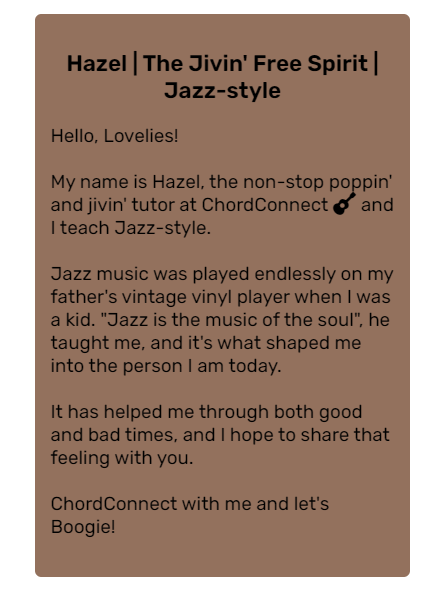

# ChordConnect

ChordConnect has made learning guitar as simple as learning your ABCs and 123s for individuals of all ages and skill levels. It is designed as a fully online programme that provides high-quality one-to-one lessons to anyone, anywhere in the world. The programme is managed by a group of dedicated professional guitarists, each with their own musical style. "Rock," "Jazz" and "Blues" are the three most popular styles. To become the next Jimi Hendrix, Jimmy Page (Led Zeppelin) or Brian May (Queen), all you need is a dash of curiosity, a six-stringed guitar and a lesson with Chordconnect!

## Features 

### Existing Features

- __Navigation Bar__

  - A full responsive navigation bar that is fixed at the top of the screen and present across the entire website, from the header to sections to the footer, to enable quick and easy navigation and prevent scrolling repetition.
  - It includes links to the Logo, Homepage, About us, Tutors, Testimonials, Sign up form and Contact information.

- __Hamburger Menu__

  - A complete responsive hamburger menu fixed at the top of the screen is a feature of displays for tablets and mobile phones, allowing for quick and straightforward navigation and minimizing scrolling repetition.
  - It expands upon clicking to show links to the Logo, Homepage, About Us, Tutors, Testimonials, Sign up form, and Contact information.

- __The landing page image__

  - The landing page features an image with text overlay to show the pricing of the lessons as well as a special offer for all newcomers to the programme.
  - A button is also added to take the user directly to the Sign up form, bypassing all prior material and information, allowing the user a fast and simple sign up procedure.
  - This part draws the user's attention to ChordConnect using an aesthetically stunning image and banner.

- __About Us Section__

  - The about us will provide the user with an overview of ChordConnect, its most popular music style lessons, further information about the special offer for new "ChordConnectors," and a phrase at the end to urge the user to start learning and playing the guitar with them.

- __Meet the Tutors section__

  - The user will be able to get better acquainted with the ChordConnect tutors in this section, and when the mouse "hovers" or the photo is "clicked on", the images will flip over to reveal the tutors' name and information.
  - The "flip card" animation will allow for engaging user interaction and captivate their attention.

- __Testimonials__

  - The testimonials area will allow users to hear what other people, their peers, have experienced while learning guitar with ChordConnect. It is an essential feature to establish trust with future "ChordConnectors".
  - Three testimonials are presented, each with a photo of the person, name, age, location, statements, and a star rating at the bottom. It is designed in a clear and concise manner.

- __The Sign Up Page__

  - This page will allow the user to get signed up to ChordConnect to begin their path to become the next great guitarist. 
  - The user will be required to submit their basic details, including their first name, last name and email address.
  - For assessment of the user's guitar skill level, the user will be asked "What guitar skill level are you?" and will have the option of selecting "Beginner, Intermediate, Advanced or I'm Not Sure".
  - The user will also have the option to answer "How did you hear about us?" to aid ChordConnect with advertising.
  - Lastly, a textarea box is included at the bottom for any further questions or information the user wishes to disclose.

- __The Footer__ 

  - The footer section includes contact details for users to phone or email ChordConnect if there are any queries or issues.
  - It also includes the social media links for ChordConnect's Facebook, Twitter, Instagram and YouTube pages, all of which, will open to a new browser tab for quick navigation and removal of the "back button" repetition.
  - Lastly, a copyright tag is placed at the end of the page.

### Future goals

  - To add a gallery collection of ChordConnect students playing guitar live onstage and concerts.
  - To create it in a slideshow animation which would require better javascript knowledge.
  - To use a video as the "landing page" or "hero image" which was initially used but later replaced by a still image due to responsiveness issues.

## Technology Used

* HTML, CSS & Javascript programming languages
* [Google Fonts](https://fonts.google.com/) - Comfortaa & Rubik Font Styles
* [Font Awesome](https://fontawesome.com/) - Logos for "ChordConnect", "Hamburger Menu", "Star ratings", "Contact Details", "Social Media" and "Copyright"
* [Gitpod](https://www.gitpod.io/) - Cloud development environment
* [GitHub](https://github.com/) - Repositories
* [Favicon](https://www.favicon.cc/) - Browser tab logo
* [Coolers](https://coolors.co/palette/875331-bf844f-58321c-b08f72) - ChordConnect Theme Color Palette
* [ResizePixel](https://www.resizepixel.com/download) - Resize and compress images
* [Convertio](https://convertio.co/jpg-webp/) - Convert jpeg files into webp format
* [Ui.Dev](https://ui.dev/amiresponsive) - Website on different screens

## Testing 

  - Testing was carried out by Chrome DevTools to ensure the website had the appropriate scaling for laptop, tablet and moble phone screens.
  - Lighthouse
    - [Lighthouse](https://chrome.google.com/webstore/detail/lighthouse/blipmdconlkpinefehnmjammfjpmpbjk?hl=en) was used throughout the project to improve webpage performance, accessibility and reduce loading screen times.
      - Website Desktop Report

      
      - Website Mobile Phone Report

      

### Validator Testing 

- HTML
  - No errors were found when passing through the official [W3C validator](https://validator.w3.org/)

- CSS
  - No errors were found when passing through the official [(Jigsaw) validator](https://jigsaw.w3.org/css-validator/)

### Bugs Encountered & Resolved

  - Chrome DevTools failed logo and navigation bar color contrast - Resolved by adjusting to darker color hues.

  - Chrome DevTools failed banner text and hero image contrast - Resolved by changing its opacity and choosing a grey color.

  - Navigation links did not fit well under logo on tablet and mobile phone screens - Resolved by using javascript for hamburger menu.

  - Image responsiveness on tablet and mobile phone screens - Mentor advised to implement flexbox into code.

## Deployment

To deploy this page to GitHub Pages from its [GitHub repository](https://github.com/D0nni387/Luxury-Door-Solutions), the following steps were taken: 

1. From the menu items near the top of the page, select **Settings**.
2. Scroll down to the **GitHub Pages** section.
3. Under **Source** click the drop-down menu labelled **None** and select **Master Branch**
4. On selecting Master Branch the page is automatically refreshed, the website is now deployed. 
5. Scroll back down to the **GitHub Pages** section to retrieve the link to the deployed website.

## Credits 

### Content 

- The 62.5% font size trick was taken from [Aleksandr Hovhannisyan](https://www.aleksandrhovhannisyan.com/blog/62-5-percent-font-size-trick/)
- Instructions on how to create a hamburger menu were taken from [Sakshi Sawant](https://blog.devgenius.io/create-a-responsive-navigation-bar-in-html-css-and-js-4648ce90fd6c)
- Instructions on how to create animated buttons were taken from [W3Schools](https://www.w3schools.com/howto/howto_css_animate_buttons.asp)
- Instrucitons on how to create a flip card were taken from [W3Schools](https://www.w3schools.com/howto/howto_css_flip_card.asp)
- Instructions on how to make circular images were taken from [William Craig](https://www.webfx.com/blog/web-design/circular-images-css/)
- The CSS background-image property trick was taken from [W3Schools](https://www.w3schools.com/cssref/pr_background-image.php)
- All icons on this webpage were taken from [Font Awesome](https://fontawesome.com/)

### Media

- All images on this webpage were taken from [Pexel](https://www.pexels.com/)
